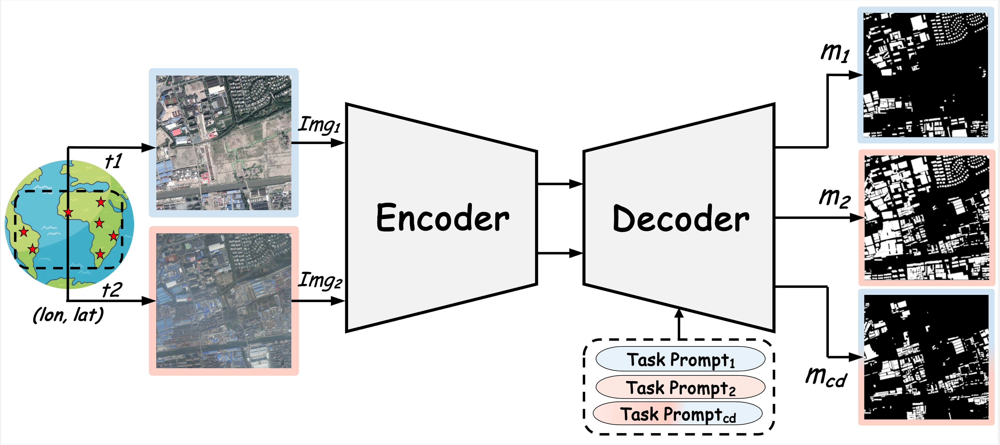

<div align="center">
    <h2>
        RSBuilding: Towards General Remote Sensing Image Building Extraction and Change Detection with Foundation Model
    </h2>
    <p>
        Mingze Wang<sup>†</sup>, <a href="https://github.com/KyanChen">Keyan Chen<sup>†</sup></a>, Lili Su, Cilin Yan, Sheng Xu, Haotian Zhang, Pengcheng Yuan, Xiaolong Jiang and Baochang Zhang<sup>*</sup>
    </p>
</div>

[](https://github.com/Meize0729/RSBuilding)
[](LICENSE)
[](http://arxiv.org/abs/2403.07564)

<div align="center">
  
</div>


## Introduction

This repository is the code implementation of the paper [RSBuilding: Towards General Remote Sensing Image Building Extraction and Change Detection with Foundation Model](http://arxiv.org/abs/2403.07564), which is based on the [Open-cd](https://github.com/likyoo/open-cd) project.

The current branch has been tested under PyTorch 2.0.1 and CUDA 11.7, supports Python 3.7+, and is compatible with most CUDA versions.

If you find this project helpful, please give us a star ⭐️, your support is our greatest motivation.

## Update Log

🌟 **2024.03.13** Release the source code.

🌟 **2024.03.12** Updated the paper content, see [Arxiv](http://arxiv.org/abs/2403.07564) for details.

## Table of Contents

- [Introduction](#Introduction)
- [Update Log](#Update-Log)
- [Table of Contents](#Table-of-Contents)
- [1.Installation](#1.-Installation)
- [2.Dataset Preparation](#2.-Dataset-Preparation)
- [3.Model Training](#3.-Model-Training)
- [4.Model Testing](#4.-Model-Testing)
- [Common Problems](#Common-Problems)
- [Acknowledgement](#Acknowledgement)
- [Citation](#Citation)
- [License](#License)
- [Contact](#Contact)

## 1. Installation

### Dependencies

- Linux
- Python 3.7+, recommended 3.9
- PyTorch 2.0 or higher, recommended 2.0
- CUDA 11.7 or higher, recommended 11.7
- MMCV 2.0 or higher, recommended 2.0

### Install RSBuilding

Download or clone the RSBuilding repository.

```shell
git clone git@github.com:Meize0729/RSBuilding.git
cd RSBuilding
```

### Environment Installation

We recommend using Miniconda for installation. The following command will create a virtual environment named `rsbuilding` and install PyTorch and MMCV.

Note: If you have experience with PyTorch and have already installed it, you can skip to the next section. Otherwise, you can follow these steps to prepare.

<details>

**Tips**: We recommend installing the version that has been practically tested and proven to work.

**Step 0**: Install [Miniconda](https://docs.conda.io/projects/miniconda/en/latest/index.html).

**Step 1**: Create a virtual environment named `rsbuilding` and activate it.

```shell
conda create --name rsbuilding python=3.9
conda activate rsbuilding
```

**Step 2**: Install [PyTorch](https://pytorch.org/get-started/locally/), we recommend using conda to install the following version:

```shell
conda install pytorch==2.0.1 torchvision==0.15.2 torchaudio==2.0.2 pytorch-cuda=11.7 -c pytorch -c nvidia
```

**Step 3**: Install [MMCV](https://mmcv.readthedocs.io/en/latest/get_started/installation.html). We recommend using pip to install the following version:

```shell
pip install mmcv==2.0.1 -f https://download.openmmlab.com/mmcv/dist/cu117/torch2.0/index.html -i https://pypi.tuna.tsinghua.edu.cn/simple
```

**Step 4**: Install other dependencies.

```shell
pip install -r requirements.txt
```

</details>

## 2. Dataset Preparation

We provide the dataset preparation method used in the paper. Data preparation and preprocessing can be somewhat time-consuming. You may choose to work with only the datasets you wish to use.

You can access detailed preprocessing instructions at [the following location](tools/data_proces/README.md):

```shell
cd tools/data_process.md
```

✅ Upon completing all the data preprocessing steps along this path, I trust that the train.txt and test.txt files within your `data_list` folder for the datasets you plan to use have been accurately populated with the absolute paths.


## 3. Model Training

The entire training process involves: **Pretrain ➡️ Finetune on specific datasets**.

We provide the configuration files of the models used in the paper, which can be found in the `configs_pretrain` and `configs_finetune` folder. The Config file is completely consistent with the API interface and usage method of MMsegmentation. If you want to know more about the meaning of the parameters, you can refer to the [MMSegmentation documentation](https://mmsegmentation.readthedocs.io/zh-cn/latest/user_guides/1_config.html).

### Pretrain

We offer configuration files for four different backbone models. The pre-training process can be skipped as we have released our pre-trained weights.

During the pre-training process, the training will be conducted on the datasets listed in `data_list/pretrain/train.txt`. You can add or remove any dataset as needed, while monitoring the metrics using the datasets shown in `data_list/pretrain/test.txt`.

**Step1**: During the pre-training phase, we require the pre-trained weights of the backbone for initialization. You can obtain the pre-trained weights for the [Swin](https://github.com/open-mmlab/mmsegmentation/tree/v1.0.0/configs/swin) series here, and for the [ViT](https://github.com/open-mmlab/mmpretrain/tree/17a886cb5825cd8c26df4e65f7112d404b99fe12/configs/sam) series here, or find specific download links in `configs_pretrain/__base__/models/xxx.py`. We have not included the preprocessing code for the pre-trained weights in this repository, but it is straightforward to handle.

**❗️Step2❗️**: After downloading the pre-trained weights for backbone, you need to replace **Line 32** in `configs_pretrain/xxx.py` with the specific path. Meanwhile, change the **Line 41** to the location where you want to save the training logs and weights.

**Step3**: And then, use following command to train your own model:

```shell script
# Single-Card Training
python tools/train.py configs_pretrain/xxx.py  # xxx.py is the configuration file you want to use

# Multi-Card Training
sh ./tools/dist_train.sh configs_pretrain/xxx.py ${GPU_NUM}  # xxx.py is the configuration file you want to use, GPU_NUM is the number of GPUs used
```

### Finetune

**Step1**: Download the pre-trained model from following link: [Baidu NetDisk]() and [Google Drive](). If you use your own pre-trained weights, you can ignore the above steps. But we are sorry, we are not yet able to release our pre-trained weights publicly.

**❗️Step2❗️**: After downloading the pre-trained weights, you need to replace **Line 33** in `configs_finetune/***/xxx.py` with the specific path. Meanwhile, change the **Line 41** to the location where you want to save the training logs and weights.

**Step3**: And then, use following command to train your own model or use the command specified in the configuration file to start the training:

```shell script
# Single-Card Training
python tools/train.py configs_finetune/xxx.py  # xxx.py is the configuration file you want to use

# Multi-Card Training
sh ./tools/dist_train.sh configs_finetune/xxx.py ${GPU_NUM}  # xxx.py is the configuration file you want to use, GPU_NUM is the number of GPUs used
```

## 4. Model Testing

After you have obtained the fine-tuned model weights on a specific dataset, you can perform metric testing using the following command.

```shell script
# Single-Card Testing
python tools/test.py configs_finetune/***/xxx.py ${CHECKPOINT_FILE} # xxx.py is the configuration file you want to use, CHECKPOINT_FILE is the checkpoint file you want to use

# Multi-Card Testing
sh ./tools/dist_train.sh configs_finetune/***/xxx.py ${CHECKPOINT_FILE} ${GPU_NUM}  # xxx.py is the configuration file you want to use, CHECKPOINT_FILE is the checkpoint file you want to use, GPU_NUM is the number of GPUs used
```

## Common Problems

<details>
</details>

## Acknowledgement

This project is developed based on the [Open-cd](https://github.com/likyoo/open-cd) and [MMSegmentation](https://github.com/open-mmlab/mmsegmentation) project. Thanks to the developers of these projects.

## Citation

If you use the code, performance benchmarks and pre-trained weights of this project in your research, please refer to the bibtex below to cite RSBuilding.

```
@misc{wang2024rsbuilding,
  title={RSBuilding: Towards General Remote Sensing Image Building Extraction and Change Detection with Foundation Model}, 
  author={Mingze Wang and Keyan Chen and Lili Su and Cilin Yan and Sheng Xu and Haotian Zhang and Pengcheng Yuan and Xiaolong Jiang and Baochang Zhang},
  year={2024},
  eprint={2403.07564},
  archivePrefix={arXiv},
  primaryClass={cs.CV}
}
```

## License

This project is licensed under the [Apache 2.0 license](LICENSE).

## Contact

If you have any other questions❓, please contact wmz20000729@buaa.edu.com in time 👬.

I apologize, the code we provide has not been thoroughly optimized. We will continue to refine it.

We will certainly do our utmost to assist you, and your inquiries will also contribute significantly to the optimization of this project.


